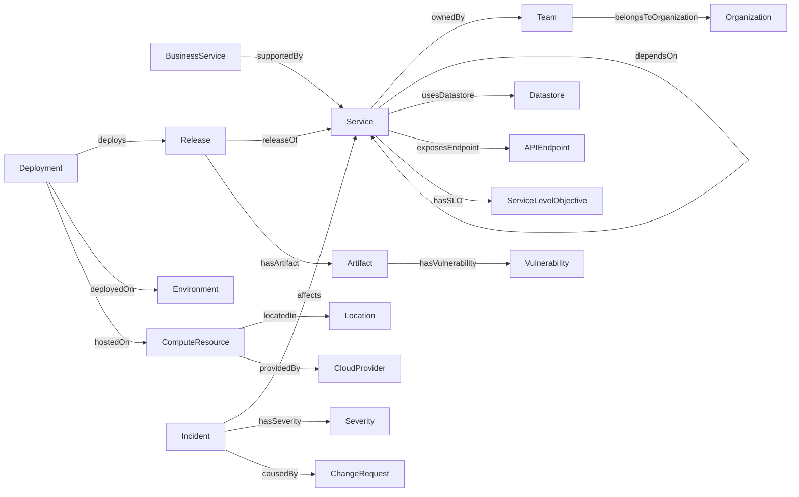

# 企业生产环境本体 · Enterprise Production Environment Ontology (EPS)

一个可复用的 **OWL / RDF** 本体，用于形式化描述企业的**线上 IT 生产环境**——
从运行它的组织、底层基础设施，到部署其上的软件服务、发布流程、Day‑2 运维与可靠性，
再到安全合规态势。可作为一个轻量级 **CMDB / SRE 知识图谱模型**，支持 SPARQL 查询与 OWL 推理。

> A reusable OWL ontology that models an enterprise's live IT production estate:
> the org that runs it, the infrastructure, the services deployed on top, the
> deploy/release process, day‑2 operations & reliability, and security/compliance.

| | |
|---|---|
| **格式 / Format** | OWL 2 (RDF 1.1 Turtle) |
| **命名空间 / Namespace** | `https://example.org/ontology/enterprise-production#` |
| **前缀 / Prefix** | `eps:` |
| **版本 / Version** | 1.0.0 |
| **规模 / Size** | 73 类 · 47 对象属性 · 18 数据属性 · 26 受控词表个体 |
| **复用词表 / Reuses** | `owl` `rdfs` `xsd` `dcterms` `skos` `foaf` `vann` |

## 文件结构 / Files

```
ontology/
├── enterprise-production.ttl       # 本体主体 (TBox + 受控词表个体)
├── examples/
│   └── sample-instances.ttl        # 示例数据 (ABox)：Acme 公司结算系统生产快照
├── queries/                        # SPARQL 能力问题查询 (competency questions)
│   ├── cq01-services-without-owner.rq
│   ├── cq02-production-deployments.rq
│   ├── cq03-blast-radius.rq
│   ├── cq04-critical-incidents.rq
│   └── cq05-vulnerable-prod-artifacts.rq
└── README.md
```

## 建模范围 / Eight modules

本体按八个主题模块组织（均以 `eps:Entity` 为根）：

1. **组织与人员 / Organization & People** — `Organization` `OrganizationalUnit` `Team` `Person` `Role`
2. **位置与云厂商 / Location & Providers** — `DataCenter` `CloudRegion` `AvailabilityZone` `CloudProvider`
3. **基础设施 / Infrastructure** — 计算 `ComputeResource`（`PhysicalServer` `VirtualMachine` `Container` `Pod` `Cluster`）、网络 `NetworkResource`（`Network` `Subnet` `LoadBalancer` `Firewall` `APIGateway`）、存储 `StorageResource`（`BlockVolume` `ObjectStore` `FileShare`）
4. **软件系统与服务 / Software Systems** — `Application` `Service` `Microservice` `Datastore`（`Database` `CacheStore` `MessageBroker`）`Middleware` `APIEndpoint`
5. **部署 / 发布 / 配置 / Deployment, Release & Config** — `Environment` `Deployment` `Release` `Artifact`（`ContainerImage` `Package`）`Pipeline` `Configuration` `Secret` `FeatureFlag`
6. **运维与可靠性 / Operations & Reliability** — `Incident` `Alert` `ChangeRequest` `MaintenanceWindow` `Monitor` `Metric` `Runbook` `ServiceLevelObjective` `ServiceLevelIndicator` `ServiceLevelAgreement` `Severity` `IncidentStatus`
7. **安全与合规 / Security & Compliance** — `Vulnerability` `Policy` `AccessControlRule` `Certificate` `ComplianceStandard`
8. **业务层 / Business** — `BusinessService` `Customer`

### 核心关系图 / Core relationships



## 受控词表 / Controlled vocabularies

本体内置了若干标准个体，开箱即用：

- **环境 / Environment**：`eps:Production` `eps:Staging` `eps:Testing` `eps:Development` `eps:DisasterRecovery`（`Production` 与 `DisasterRecovery` 标注 `eps:isProduction true`）
- **严重级别 / Severity**：`eps:SEV1`…`eps:SEV4`
- **事件状态 / IncidentStatus**：`StatusOpen` `StatusInvestigating` `StatusMitigated` `StatusResolved` `StatusClosed`
- **角色 / Role**：`ServiceOwner` `OnCallEngineer` `SRE` `Developer`
- **云厂商 / CloudProvider**：`AWS` `Azure` `GCP` `AlibabaCloud`
- **合规标准 / ComplianceStandard**：`ISO27001` `SOC2` `GDPR` `PCIDSS`

## 形式化公理 / Formal axioms（部分）

本体不只是词表，还编码了可被推理机利用的约束：

- 每个 `Deployment` 必然 `deployedOn` 某个 `Environment`；`deployedOn` 为**函数性**（唯一目标环境）。
- 每个 `Service` 必须 `ownedBy` 某个 `Team`（治理不变量）。
- 每个 `Incident` 有且仅有一个 `Severity` 和一个 `Status`（`hasSeverity`/`hasStatus` 为函数性）。
- `dependsOn`、`locatedIn` 为**传递性**属性；`connectedTo` 为**对称性**属性。
- `usesDatastore` ⊑ `dependsOn`（子属性）；`owns` 与 `ownedBy`、`exposesEndpoint` 与 `endpointOf` 等互为逆属性。
- 不相交公理：`Person`/`Team`/`Organization` 两两不相交，`Service` 与 `Datastore` 不相交，`PhysicalServer` 与 `VirtualMachine` 不相交。

> 在 OWL 2 RL 推理下本体**一致（consistent）**，并能推出如「`CheckoutService ownedBy PaymentsTeam`」（逆属性）、「`CheckoutService dependsOn OrdersDB`」（子属性链）等蕴含。

## 在 Protégé 中打开 / Open in Protégé

1. 下载 [Protégé Desktop](https://protege.stanford.edu/)。
2. `File → Open…` 选择 `ontology/enterprise-production.ttl`。
3. 浏览 **Classes / Object Properties / Data Properties / Individuals** 标签页。
4. 启动推理机（`Reasoner → HermiT → Start reasoner`）即可看到推断出的层级与属性断言。
5. 加载示例数据：`File → Open…` 打开 `examples/sample-instances.ttl`（它通过 `owl:imports` 自动引入主体本体）。

## 用 SPARQL 查询 / Query with SPARQL

`queries/` 下是 5 个**能力问题（competency question）**查询，覆盖治理、运维、安全等典型问法：

| 查询 | 回答的问题 |
|---|---|
| `cq01-services-without-owner` | 哪些服务没有归属团队？（治理缺口） |
| `cq02-production-deployments` | 生产环境跑着什么？版本/副本数/所在主机？ |
| `cq03-blast-radius` | 某服务故障的影响面（传递依赖者）？ |
| `cq04-critical-incidents` | 所有 SEV1 事件、受影响服务、根因、负责人、状态？ |
| `cq05-vulnerable-prod-artifacts` | 生产环境中含高危漏洞（CVSS≥7）的制品？ |

### 复现校验 / Reproduce the validation

需要 `rdflib`（语法/查询）与可选的 `owlrl`（推理）：

```bash
pip install rdflib owlrl

# 语法校验 + 跑全部查询
python3 - <<'PY'
import glob
from rdflib import Graph
g = Graph()
g.parse('ontology/enterprise-production.ttl', format='turtle')
g.parse('ontology/examples/sample-instances.ttl', format='turtle')
print('triples:', len(g))
for f in sorted(glob.glob('ontology/queries/*.rq')):
    rows = list(g.query(open(f).read()))
    print(f'\n{f} -> {len(rows)} row(s)')
    for r in rows:
        print('  ', ' | '.join(map(str, r)))
PY
```

## 扩展指南 / Extending

- **换成你自己的域名**：把命名空间里的 `example.org` 改为你的组织域名（例如 `cmdb.acme.com`），保持 IRI 稳定可解引用。
- **细化分类**：在相应模块下用 `rdfs:subClassOf` 增加子类（如把 `MessageBroker` 细分 `Kafka` / `RabbitMQ` 实例，或新增 `ServerlessFunction ⊑ ComputeResource`）。
- **对接现有数据**：把 CMDB / Kubernetes / Terraform / 监控系统导出的资源映射为本体个体（ABox），即可在其上跑上面的 SPARQL 治理与影响面分析。
- **与外部词表对齐**：`eps:Person` 已 `rdfs:subClassOf foaf:Person`；可继续用 `owl:equivalentClass` / `rdfs:subClassOf` 对齐到企业内部或行业标准词表。

## 许可 / License

本体以 [CC BY 4.0](https://creativecommons.org/licenses/by/4.0/) 提供（见 `dcterms:license`）。
